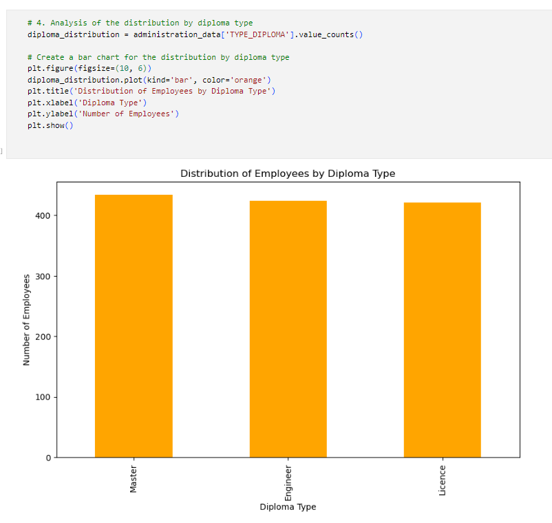

# The Employee Insights Hub 
## 📊 Exploratory Data Analysis (EDA)

To better understand the dataset and prepare it for further analysis, an exploratory data analysis was conducted.

###  Objectives of the EDA
The main goals of this step were to:
- Visualize the data distribution
- Identify trends and patterns
- Detect outliers
- Understand correlations and relationships between variables

Through this analysis, we gained valuable insights that guided the data preprocessing and modeling phases.
### 1) Gender Distribution

Bar chart showing the gender distribution in the company.

==>The figure shows that the proportion of men and women in our workforce is relatively balanced, with a slight male predominance.

### 2) Education Level Distribution

Bar chart illustrating the distribution of employees’ education levels.

==> The figure shows that most of our employees have a Master’s degree, followed by a significant number of individuals with Bachelor’s degrees, and then by those holding Engineer diplomas.

### 3) Employee Distribution by Job Grade

Bar chart illustrating the distribution of employees by job grade within the company.

It is evident that the most common grades are "Financial" and "Manager", closely followed by "Communication" and "Department Head". The "Human Resources" grade is also well represented.

### 4) Contract Type Distribution

Pie chart showing the distribution of contract types among employees.

The figure illustrates that **fixed-term contracts (CDD)** are the most common, followed closely by **vocational integration contracts (CIVP)**, and then by **permanent contracts (CDI)**.

### 5) Relationship Between Overtime Hours and Job Grades

Bar chart illustrating the relationship between overtime hours and job grades.

This analysis highlights a correlation between employees’ job grades and the number of overtime hours worked. Directors tend to work the most overtime hours, while the Human Resources department records the fewest overtime hours, suggesting differences in workload and time management across different job grades.

### 6) Correlation Matrix Between Dataset Variables

This graph represents a heatmap of the correlation matrix between the various variables of the data frame. The numerical values indicated in each cell represent the correlation coefficient between pairs of variables. Darker colors indicate a stronger correlation, while lighter colors indicate a weaker correlation. This allows for a quick visualization of linear relationships between dataset variables.

### 7) Bar Chart Illustrating the Distribution by Difficulty of Training Courses

This bar chart represents the distribution of the difficulty levels of training courses. It can be observed that most of the courses have a **"BEGINNER"** difficulty level, followed by **"ADVANCED"** and **"INTERMEDIATE"** levels. **"Conversant"** level courses are also present, although less frequently. Finally, the **"Not calibrated"** level is the least represented in our data.

# 📊 Data Visualization and Dashboards

### .1 Introduction

In this chapter, a detailed analysis of data visualization modeling is conducted in order to provide the company with valuable insights.

### .2 Reporting

In this section, the different dashboards related to our analysis topics are presented along with descriptive explanations.

The layout of the homepage is meticulously crafted to cater to the specific needs of our key user, namely the **HR manager**.
# Dashboard HR manager
## Figure 1 – Dashboard: "Home"

This is the main interface that provides an overview of key indicators and serves as an entry point for deeper exploration into employee data.

### Figures 2 to 8 represent the **HR manager’s dashboard**, composed of several key performance indicators (KPIs) to facilitate strategic decision-making.

Global filters have been applied across the entire dashboard page:
- **Gender** filter: Female, Male
- **Year** filter: From 2000 to 2022

## Figure 2 – HR Dashboard Overview

This figure presents key performance indicators (KPIs) and visualizations related to the overall workforce composition and employment statistics.

- **Total Employees**: Total number of employees in the company.
- **Male**: Number of male employees, representing 50% of the workforce.
- **Female**: Number of female employees, representing 50% of the workforce.
- **Average Age**: Average age of employees, which is 49 years old.
- **Active Employees by Contract Type**:  
  Pie chart showing distribution of active employees by contract type:  
  - 506 employees on indefinite-term contracts (CDI) – 32.62%  
  - 523 employees on indefinite-term project/insertion contracts (CIVP) – 33.72%  
  - 522 employees on fixed-term contracts (CDD) – 33.66%
- **Active Employees by Department**:  
  Stacked bar chart showing the number of active employees per department:  
  - Administration: 773 employees  
  - Information Technology: 270 employees  
  - Communication: 262 employees  
  - Telecommunications: 246 employees
- **Percentage Departure by Department**:  
  Stacked histogram showing percentage of employees who left the company per department:  
  - Telecommunications: 49.2%  
  - Communication: 49.1%  
  - Information Technology: 43.4%
- **Source of Employment Rate**:  
  Funnel chart showing recruitment sources:  
  - 860 employees recruited via recommendation  
  - 833 employees recruited via recruitment sessions  
  - 806 employees recruited via free applications  
  - 165 employees recruited via ex-vacataire

## Figure 3 – Turnover and Employee Satisfaction Overview

This figure presents key indicators and visualizations related to employee turnover and satisfaction within the company.

- **Turnover Rate**: The employee turnover rate in the company, which is 34%.
- **On Service**: Number of currently active employees, which is 1551.
- **Departure**: Number of employees who have left the company, which is 653.
- **Average Employee Satisfaction**: Average rating given by employees about the company, rated 5 out of 3 (Note: vérifier cette note, peut-être une erreur de frappe).

- **Turnover by Department**:  
  Stacked bar chart showing turnover rate by department:  
  - Administration: 60%  
  - Information Technology: 13%  
  - Telecommunications: 9%  
  - Communication: 5%

- **Turnover by Grade & Gender**:  
  Stacked histogram showing turnover rates of men and women for each grade (Communication, Chef service, Director, RH et financier).

- **Turnover per Year**:  
  Line graph showing the evolution of turnover rate over time from 2000 to 2022. The curve shows remarkable stability from 2010 to 2022, indicating consistent employee retention or stable influencing factors during this period.

- **Average Employee Satisfaction per Year**:  
  Line graph representing the evolution of employee satisfaction ratings over time.

## Figure 4 – Employee Leave Statistics

This figure presents key indicators and visualizations related to different types of employee leave during the period from 2000 to 2022.

- **Ordinary**: Percentage of employees who took an "Ordinary" leave, representing 24.59%.
- **Mission**: Percentage of employees who took a "Mission" leave, representing 25.53%.
- **Sans Solde**: Percentage of employees who took an unpaid ("Sans solde") leave, representing 26.05%.
- **Sick**: Percentage of employees who took a "Sick" leave, representing 23.84%.

- **Leave Type by Tenure**:  
  Grouped histogram showing the percentage of each leave type (Ordinary, Mission, Sans solde, Sick) for tenured and non-tenured employees.

- **Leave Data By Employees**:  
  Table listing each employee's name along with two columns:  
  - **LEAVE BALANCE/h**: Number of leave hours available for the employee.  
  - **LEAVE CONSUMED/h**: Number of leave hours already used by the employee.

- **Leave Type by Department**:  
  Stacked bar chart showing the percentage of each leave type by department (Telecom, Communication, Administration, and Informatique).

- **Leave Type by Grade**:  
  Grouped histogram representing the percentage of each leave type by job grade (Communication, Financier, Chef Service, RH, and Director).

## Figure 5 – Training Sessions Overview

This figure presents key metrics and visualizations related to the training sessions completed by employees.

- **Number of Trainings**: Total number of training sessions completed by employees, amounting to 3522.

- **Number of Trainings by Difficulty Level**:  
  Pie chart showing the distribution of trainings by difficulty level:  
  - Beginner: 1444 trainings (43.99%)  
  - Advanced: 1005 trainings (30.58%)  
  - Intermediate: 837 trainings (25.47%)

- **Top Employees by Number of Trainings**:  
  Table listing employees with the highest number of completed training sessions.

- **Top 5 Courses by Department**:  
  Stacked bar chart illustrating the top five training programs by department (Communication, Informatique, and Telecom).

- **Number of Trainings per Department**:  
  Stacked histogram representing the number of trainings per department:  
  - Communication: 450 trainings  
  - IT (Informatique): 440 trainings  
  - Telecom: 391 trainings

## Figure 6 – Employee Delay and Overtime Analysis

This figure presents key performance indicators and visualizations related to employee lateness and overtime hours.

- **Average Delay Rate**: Percentage of employees arriving late compared to standard working hours, at 21%.

- **Extra Hours Admin**: Total overtime hours worked by administrators, amounting to 130,001 hours.

- **Extra Hours Vacataire**: Total overtime hours worked by vacataire employees, amounting to 71,720 hours.

- **Delay Rate by Contracts**:  
  Donut chart showing lateness rate by contract type:  
  - CDI (indefinite-term contract): 32.94%  
  - CIVP (indefinite-term project/insertion contract): 33.4%  
  - CDD (fixed-term contract): 33.66%

- **Delay Rate in 2023**:  
  Line graph representing the evolution of the lateness rate from January 2023 to July 2023.

- **The Most Absent Employees**:  
  Table listing the five employees with the highest lateness rates compared to standard working hours.

- **Delay Rate by Department**:  
  Stacked bar chart showing the lateness rate for each department.

## Figure 7 – Available Positions and Department Capacity

This figure presents key indicators and visualizations related to available job positions and departmental capacities.

- **Communication Available Positions**: Number of available positions in the Communication department, totaling 775.

- **Informatique Available Positions**: Number of available positions in the Informatique department, totaling 124.

- **Administration Available Positions**: Number of available positions in the Administration department, totaling 88.

- **Capacity by Departments**:  
  Pie chart illustrating the seating capacity of each department:  
  - Administration: 1,279 seats (48.01%)  
  - Communication: 487 seats (18.28%)  
  - Informatique: 477 seats (17.91%)  
  - Telecommunications: 421 seats (15.8%)

- **Available Positions in Communication by Year**:  
  Line graph showing the evolution of available positions in the Communication department from 2000 to 2022, with a decreasing trend indicating increased recruitment over time.

- **Available Positions in Informatique by Year**:  
  Line graph showing the evolution of available positions in the Informatique department from 2000 to 2022, also showing a decreasing trend.

- **Available Positions in Administration by Year**:  
  Line graph illustrating the evolution of available positions in the Administration department from 2000 to 2022. The curve remains stable at 200 positions from 2000 to 2009, then fluctuates starting from 2010.

## Figure 8 – Gender Equality Dashboard

This dashboard supports the company’s commitment to the Sustainable Development Goal (SDG) of gender equality by providing clear insights into employee data distribution by gender. The data can be filtered by year (from 2000 to 2022).

- **Male**: Number of male employees, representing 50% of the total workforce.

- **Female**: Number of female employees, also representing 50% of the total workforce.

- **Delay Rate by Gender**: Ring chart showing the proportion of employee delays, with 50.45% attributed to men and 49.55% to women.

- **Number of Trainings by Gender**: Stacked histogram illustrating training sessions completed, with 605 sessions for men and 616 sessions for women.

- **Active Employees by Gender & Department**: Four stacked bar charts showing the number of active employees by gender across departments (Administration, Communication, Informatique, and Telecom), highlighting near-equal representation.

- **Extra Hours by Gender**: Pie chart depicting the distribution of overtime hours worked by male and female employees.

The layout of the homepage is meticulously crafted to cater to the specific needs of our key user, namely the **HR manager**.
# Dashboard Financers
## Figure 1 – Dashboard: "Home"

This is the main interface that provides an overview of key indicators and serves as an entry point for deeper exploration into employee data.

## Figure 2 – Financial Overview Dashboard

This dashboard provides financial insights into the company’s employee compensation. Filters are available on the left to refine data by gender (female, male), year (from 2000 to 2022), and department (Administration, Communication, Informatique, and Telecom).

- **AVG Salary**: Represents the average salary of employees, which is 2,788 DT.

- **Sum of Salaries**: Represents the total salary expenditure for all employees, amounting to 7,426,771 DT.

- **Total Extra Hours Cost**: Represents the total cost of overtime hours worked, which is 5,370 DT.

- **Total Cost of Extra Hours by Year**: A stacked area chart showing the yearly evolution of overtime cost.

- **Comparison between Average, Minimum & Maximum Salaries**: A table comparing the average salary per grade within the company to the minimum and maximum salaries offered by competitor companies, providing insights on the competitiveness of the company’s salary structure.

- **Top 5 Low Paid Employees**: A grouped histogram listing the five employees with the lowest salaries in the company.

- **Top 5 High Paid Employees**: A grouped histogram listing the five employees with the highest salaries in the company.

- **Payment by Gender and Departments**: A stacked bar chart displaying the average salary by department and gender, highlighting salary distribution differences across groups.

